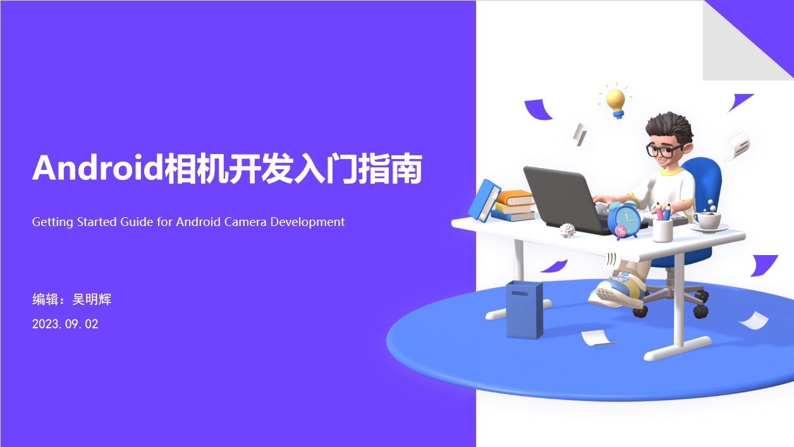
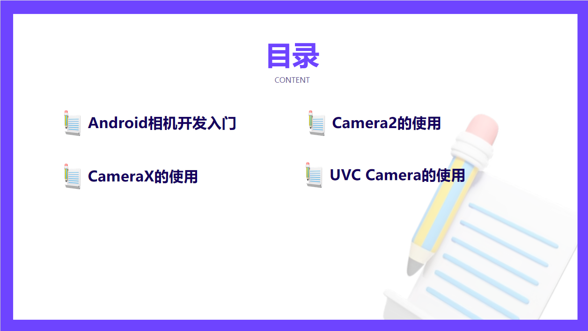
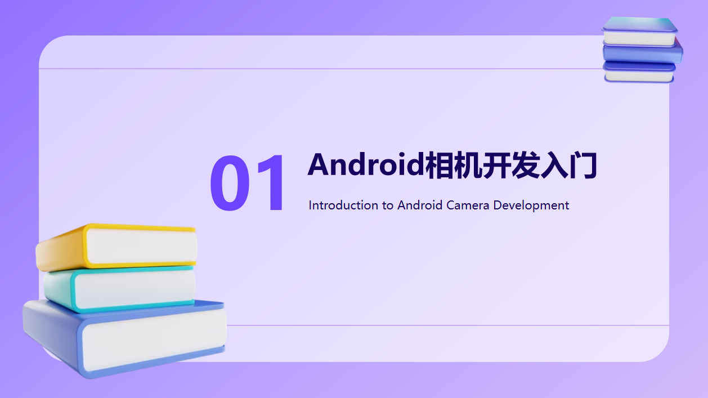
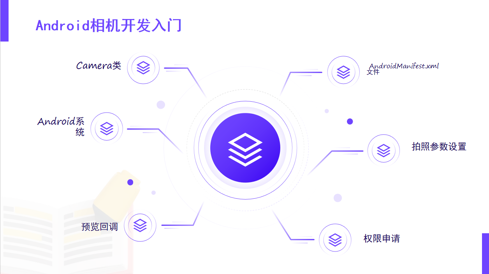
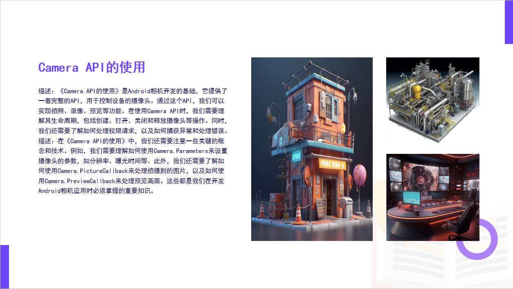
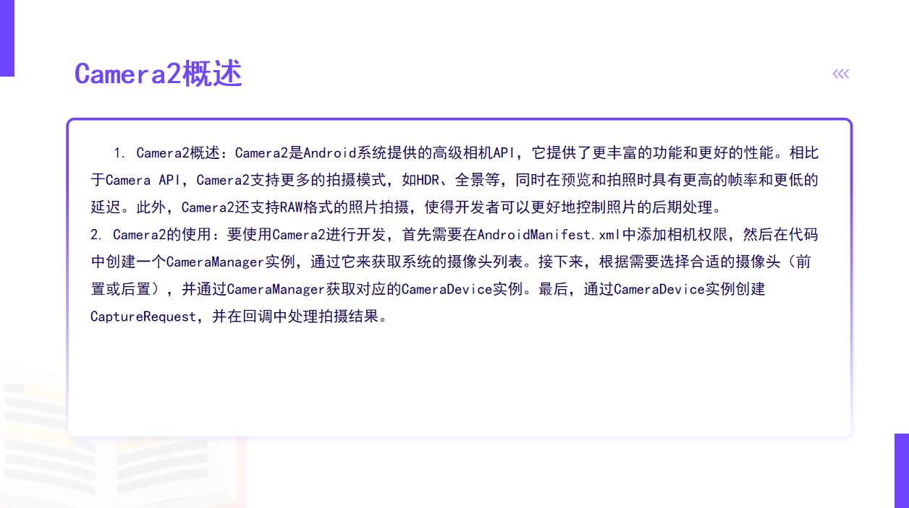
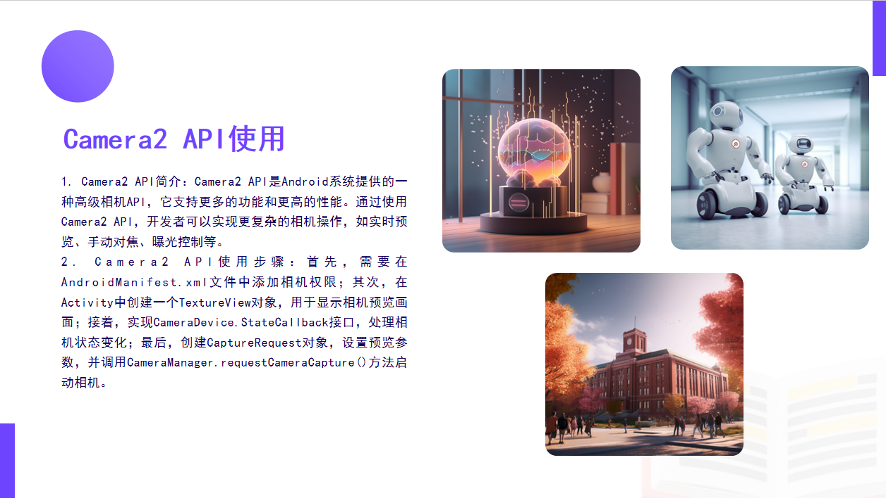
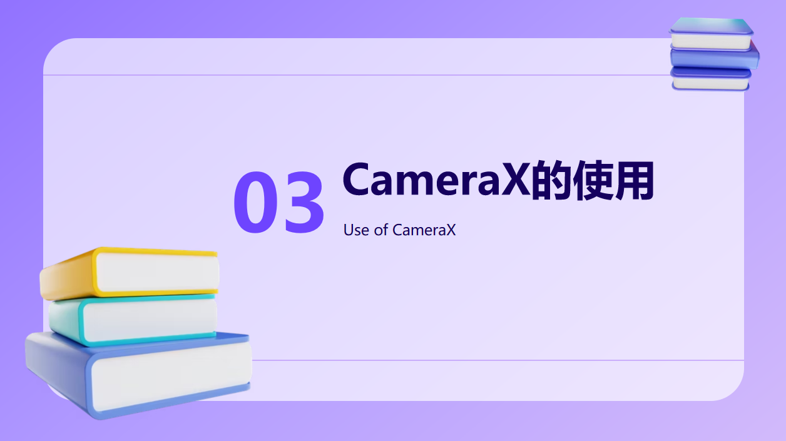
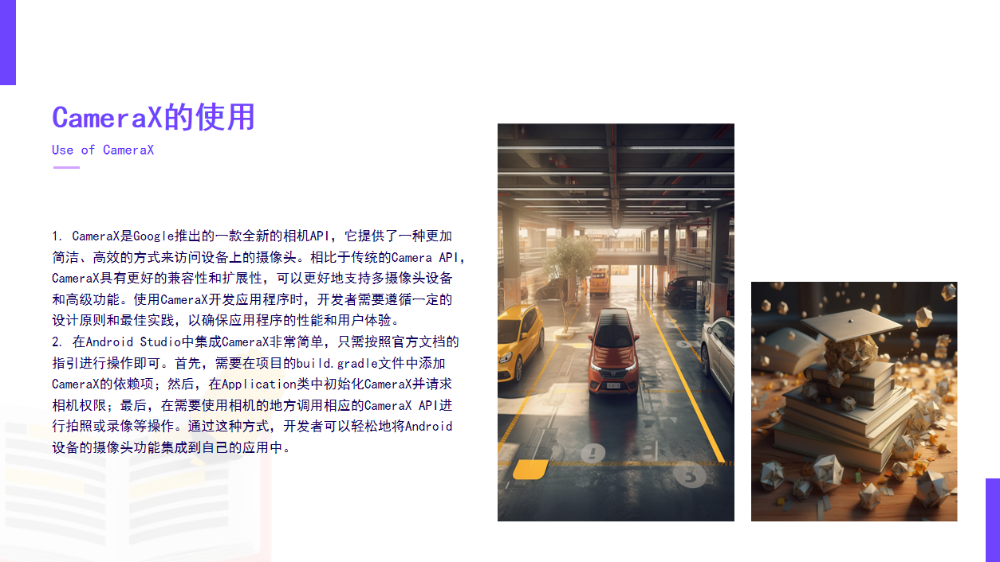
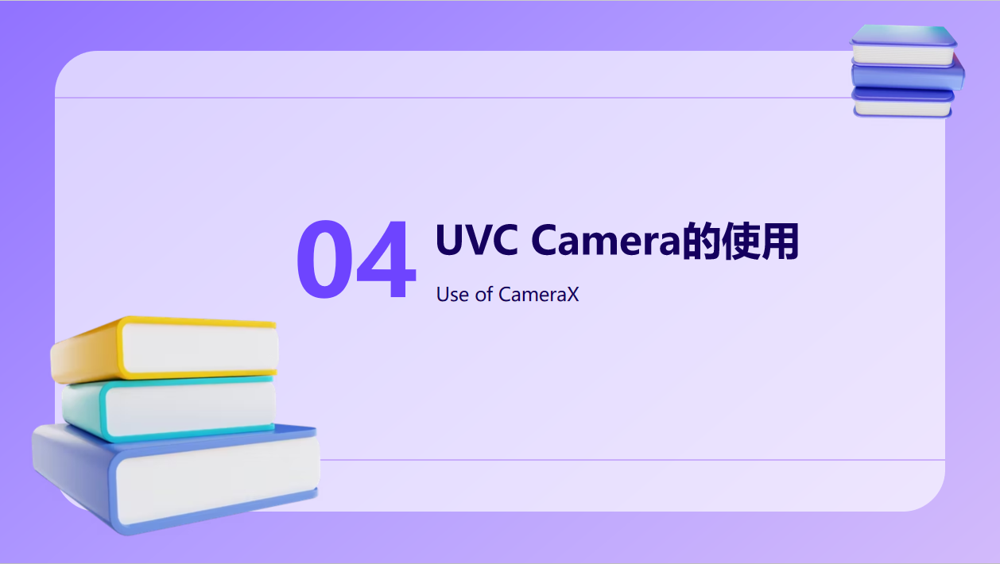

# CameraDemo
Android Camere开发入门专栏，记录Camera开发相关内容，包含Camera、Camera2、CameraX以及USB（UVC）摄像头。 和大家一起快速入门Camera开发工作，为后期的视频编解码、拍照、录像、推流等打好基础工作。

## Android Camere开发入门（1）：Camera1的使用

[Camera文章链接](https://blog.csdn.net/qq_35350654/article/details/132389732?spm=1001.2014.3001.5501)

## Android Camere开发入门（2）：Camera2的使用

[Camera2文章链接](https://blog.csdn.net/qq_35350654/article/details/132484325?spm=1001.2014.3001.5501)

## Android Camera开发入门（3）：CameraX的使用

[CameraX文章链接](https://blog.csdn.net/qq_35350654/article/details/132531847?spm=1001.2014.3001.5501)

## Android Camera开发入门（4）：USB/UVC Camera的使用

[USB/UVC Camera文章链接](https://blog.csdn.net/qq_35350654/article/details/132593725?spm=1001.2014.3001.5501)

## 代码已同步Gitee

[https://gitee.com/yunianvh/camera-demo](https://gitee.com/yunianvh/camera-demo)

## 代码已同步GitHub

https://github.com/yunianvh/CameraDemo

## 欢迎一起维护和交流

QQ：1412378121

微信：W1412378121
